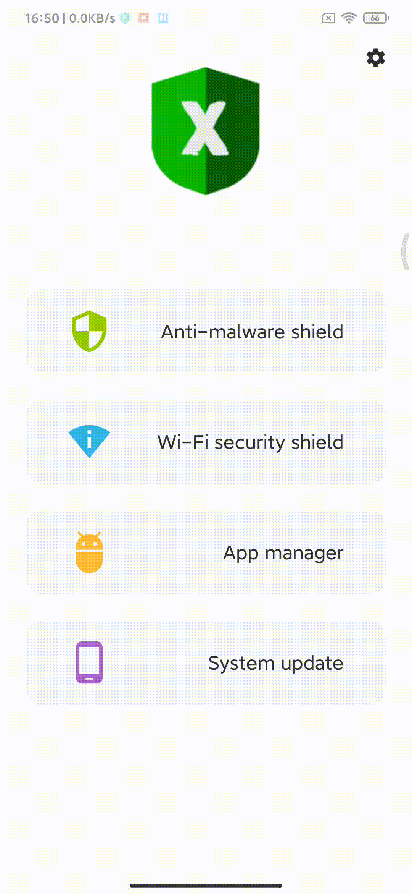
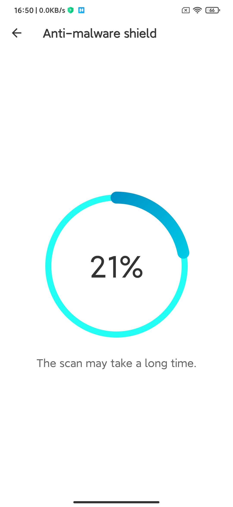
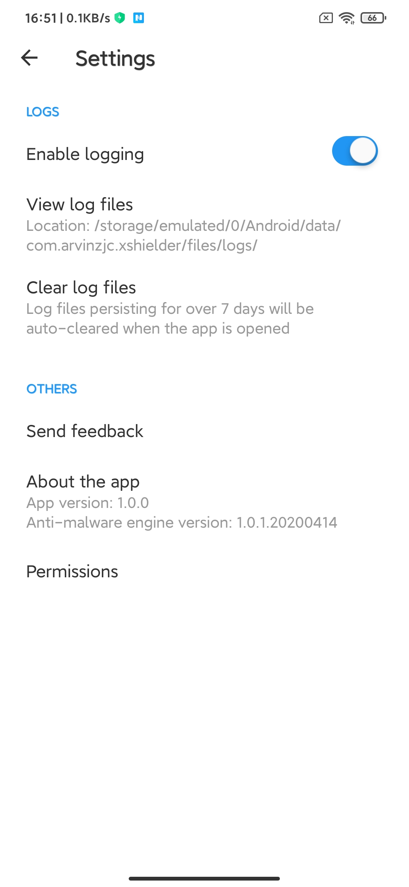
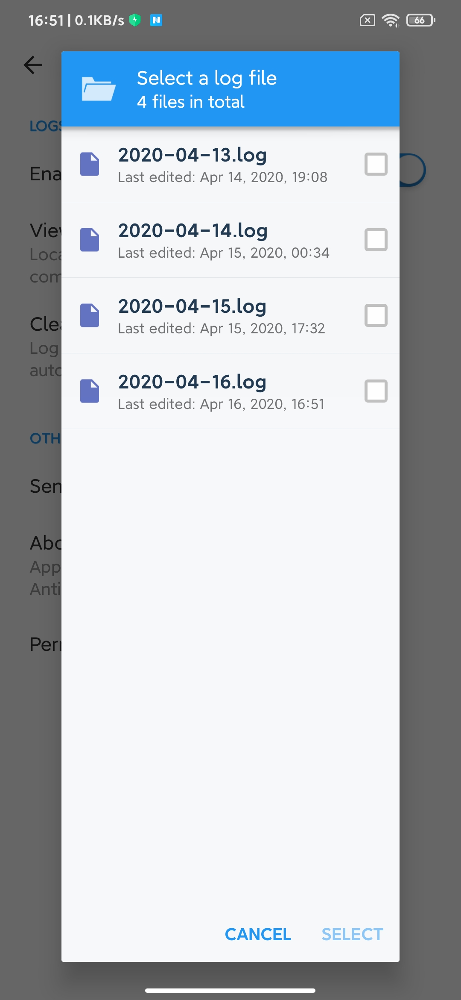
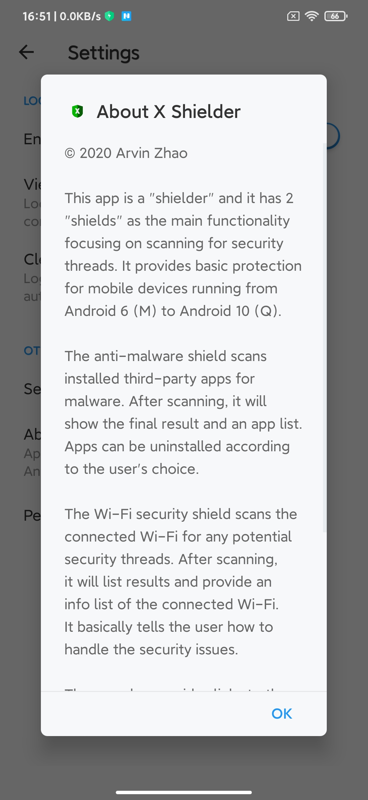
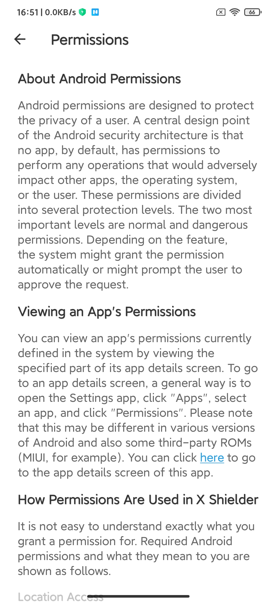

# [UoL_Y3_Project](https://github.com/ArvinZJC/UoL_Y3_Project)/XShielder

This project is named as **X Shielder** which is an Android app performing some specific security checks. The app is developed for academic study. Hence, it is not perfect enough or even practical enough in some scenarios.

## Partial UI

Figure 1
Figure 2
Figure 3
Figure 4
Figure 5
Figure 6
Figure 7
Figure 8
Figure 9

## ATTENTION

1. By 16 April 2020, everything looks good with Android Studio 3.6.2 + Java 1.8. Additionally, more than 4GB free memory is required to run the anti-malware shield normally.
2. The app targets from Android 6 (M) to Android 10 (Q). It supports the dark mode and 64-bit architectures. The trained model generated from [another artefact in this repository](https://github.com/ArvinZJC/UoL_Y3_Project/tree/master/AntiMalwareEngine) is the most important thing to run the anti-malware shield. However, due to the large file size, the CHECKPOINT files storing the model are not included here. The anti-malware shield will work abnormally without these files.
3. The app uses [Chaquopy](https://chaquo.com/chaquopy/) to enable running Python code on Android platform. This brings convenience and saves time during the development and test stages. However, please note the following points when rebuilding the project:
    - An open-source license from Chaquopy is needed to remove restrictions of Chaquopy. For more info, please refer to the [Chaquopy licensing page](https://chaquo.com/chaquopy/license/).
    - Configurations in the block `python` of the block `defaultConfig` in [the app's Gradle build script](https://github.com/ArvinZJC/UoL_Y3_Project/blob/master/XShielder/app/build.gradle) need modifications according to the build environment (i.e. select a suitable version of Python according to the version installed on Windows and the requirements of Python packages).